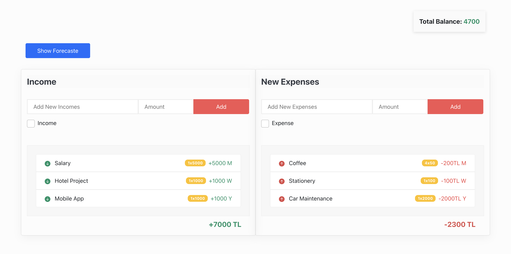
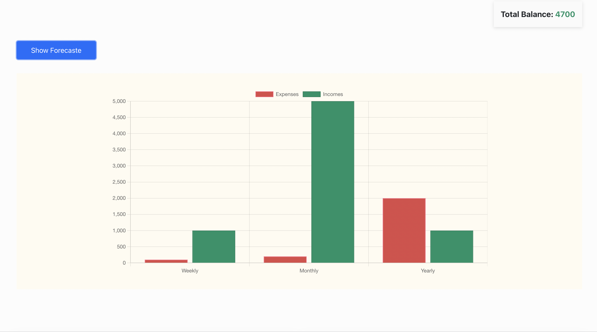

# tech-case-study

## Introduction

Tech case study is a personal expense management web application.
The website contains components where the user enters weekly, monthly and yearly expenses and income and can view statistics

## File Structure
```tech-case-study
    ├──  node_modules
    ├──  public
    │   ├──favicon.ico
    │   ├──index.html
    │    └── manifest.json
    ├──  src
    │    ├── components
    │    │    ├── Expenses.js
    │    │    ├── Forecaste.js
    │    │    ├── HomePage.js
    │    │    └── Incomes.js
    │    ├──  context
    │    │   └──  MainContext
    │    ├──  helper
    │    │      ├── expenseList.js
    │    │       ├──  incomeList.js
    │    │       ├──  recurrentType.js
    │    ├── App.css
    │    ├──  App.js
    │    ├──   App.test.js
    │    ├──  index.css
    │    ├──  reportWebVitals.js
    │    └──  setupTests.js
    ├──  .gitignore
    ├──   package-lock.json
    ├──   package.json
    └── README.md
```

## Technologies

- React
- React Context
- React Hooks
- react-bootstrap
- react-chartjs-2
- react-icons

The UI is gathered under App.css. Bootstrap was used for the collapse structure. The icons in the project are used with the react-icons npm package.
In the project, state transfer to sub-components is done with Context.

## Local Setup

Before you can run the project, you must clone this repo to your personal computer.
You must install [npm](https://nodejs.org/en/download/) on your PC.
Go to the project directory you cloned. 
Download all dependencies with ```npm install``` command.
After the dependencies are installed, you can run the project with the ```npm run``` command in the project file directory.

## Description
You can find the detailed description of the components in the table below.

| File | Description |
| ------ | ------ |
| Total Balance | Indicates the remaining balance. |
| Show Forecaste | There is a column chart that reflects the weekly, monthly and yearly display of expenses and income (forecaste.js). The react-chartjs-2 npm package is used for the column chart used. |
| Income | You can see the income list in this component. Single income or recurring income can be added upon request. It consists of two parts as list and addition area. (Incomes.js) |
| Expense | Can see the expense list in this component. It can add single expense or recurring expense according to demand. It consists of two parts as list and adding area. (Expense.js) |


